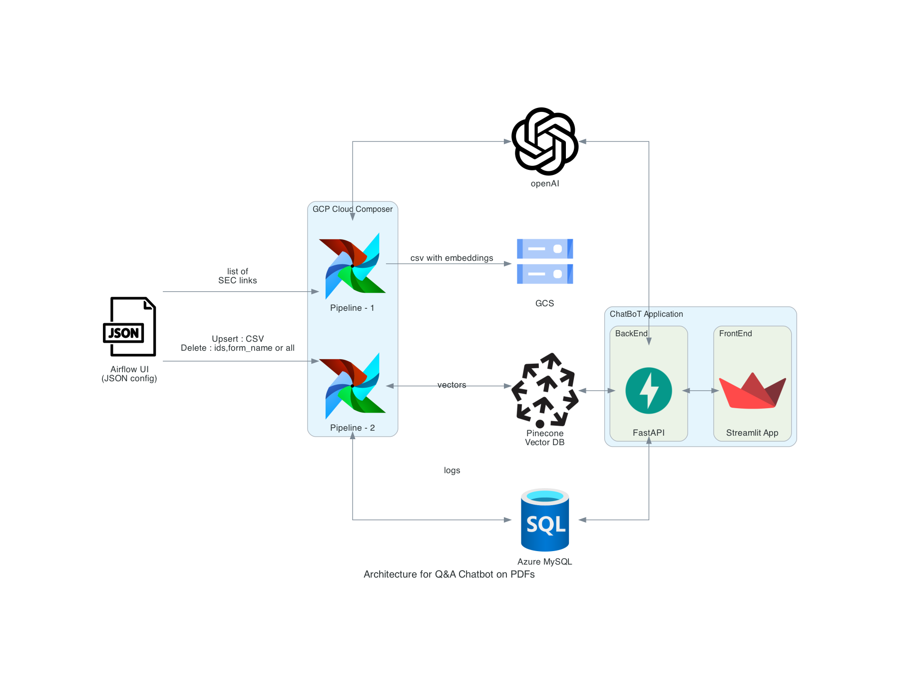

# Assignment 3 : PDF Data Processing and Querying Application using Vector Embeddings.

## Abstract
This project aims to build an Intelligent Document Search and Retrieval System that leverages the power of Airflow, FastAPI, Streamlit, and Pinecone, a vector database. The system allows users to securely register, log in, and search for information within a collection of structured documents. Users can input queries or questions, and the system will retrieve relevant documents using a similarity search technique. The project is divided into two major parts: automating data acquisition and embedding creation (Part 1) and developing a client-facing application using Streamlit and FastAPI (Part 2).


## Team Members 👥
- Aditya Kawale
  - NUID 002766716
  - Email kawale.a@northeastern.edu
- Nidhi Singh
  - NUID 002925684
  - Email singh.nidhi1@northeastern.edu
- Uddhav Zambare
  - NUID 002199488
  - Email zambare.u@northeastern.edu


## Links 📎
- Codelab Doc - [link](https://docs.google.com/document/d/1BUJotKMuDXXW1CqZrfk-Sli0t2utbHxiTiTFYFRhCYA/edit?usp=sharing)
- Demo Link - [link](https://drive.google.com/file/d/1KcwypKaM6zHN-q7LhUVlhi0JA2nway0I/view?usp=sharing)
- Airflow - [link](https://airflow.apache.org)
- Pinecone - [link](https://www.pinecone.io)
- Pinecone-client - [link](https://docs.pinecone.io/docs)
- SEC Forms - [link](https://www.sec.gov/forms)
- Nougat Library - [link](https://facebookresearch.github.io/nougat/)
- PyPDF Documentation - [link](https://pypdf.readthedocs.io/en/stable/)
- Open AI Cookbook - [link](https://github.com/openai/openai-cookbook/tree/main/examples/fine-tuned_qa)
- Streamlit - [link](https://streamlit.io/)

## Architecture 👷🏻‍♂️



## Project Workflow

## Part 1: Automating Data Acquisition and Embedding Generation

### Pipeline 1
- Designed for data acquisition and embedding generation.
- Incorporates parameters in YAML format for:
  - Specifying a list of files for processing (at least 5 from the SEC website).
  - Choosing the processing option, either "Nougat" or "PyPdf."
  - Providing credentials in YAML format.
- Implements data validation checks to ensure accurate parsed data.
- Generates embeddings and metadata associated with chunked texts.
- Saves the file extracts in a CSV file.

### Pipeline 2
- Intended for inserting records into the Pinecone vector database.
- Parameterizes the source path of the CSV file for loading into the Pinecone database.
- Capable of creating/updating/deleting the index as needed when data is refreshed.

## Part 2: Client-Facing Application using Streamlit and FastAPI

### FastAPI
- Implements user registration and login functionality.
- Utilizes JWT (JSON Web Token) authentication to secure API endpoints.
- Stores user login credentials and hashed passwords in a SQL database.
- Stores application logs in the database for auditing and troubleshooting.

### Streamlit
- Provides a user registration and login page for creating accounts and logging in securely.
- Offers a Question Answering interface for answering questions and querying information.
- Allows users to select from various preprocessed forms (at least 5) such as documents, templates, or other structured data sources.
- Enables users to input queries or questions and perform searches in the Pinecone vector database using a Similarity search technique.
- Filters searches based on the selected form.
- Performs comprehensive searches across all items in the index if no specific form is selected by the user.

This project combines the capabilities of various technologies and tools to create a robust and user-friendly system for intelligent document search and retrieval. It enhances data processing, search functionality, and user security to provide a comprehensive solution for information retrieval from structured documents.


## Steps to Execute

App can be directly accessed from Streamlit Cloud via [link](https://team7-a3-frontend.streamlit.app/)

*OR*

1. **Clone the Repository**

    Clone the [repository](https://github.com/BigDataIA-Fall2023-Team7/Assignment2-QA-Chatbot-PrivateFiles) to your local machine:
   ```
   git clone <repository_url>
   ```

**Backend**

1. **Open the Backend folder**
    Navigate to the module directory:
   ```
   cd backend
   ```

2. **Create a .env file**
    Create a `.env` file with the necessary environment variables and API Keys. Reference: [example.env](example.env)

3. **Install Dependencies:**

   Open the terminal in VSCode and run the following commands:

   ```shell
   pipenv install --dev
   ```

4. **Activate Virtual Environment:**

   To activate the virtual environment, run:

   ```shell
   pipenv shell
   ```

5. **Run the Backend Server:**

   Start the backend server using Uvicorn. Run the following command:

   ```shell
   uvicorn fastapiservice.src.app:app --reload
   ```

   Your backend API will be accessible at [http://127.0.0.1:8000](http://127.0.0.1:8000).

**Frontend**

1. **Open the Frontend folder**
    Navigate to the module directory:
   ```
   cd frontend
   ```

2. **Create a Virtual Environment:**
    Create a virtual environment and activate it:
   ```
   python -m venv venv
   source venv/bin/activate  # On Windows, use: venv\Scripts\activate
   ```

3. **Install Frontend Dependencies:**

   In the activated virtual environment, install the required Python packages:

   ```shell
   pip install -r requirements.txt
   ```

4. **Create a `secrets.toml` file**
    Create an environment variable file with the necessary variable as `.streamlit\secrets.toml`. Reference: [example_secrets.toml]()

5. **Run the Frontend Application:**

   To start the frontend application, run the following command:

   ```shell
   streamlit run main.py
   ```

## Install airflow locally
https://airflow.apache.org/docs/apache-airflow/stable/howto/docker-compose/index.html

###  Pre-requisites:
1. You must have docker desktop installed -> https://docs.docker.com/get-docker/
2. You must clone this repository
3. You must have a mysql database installed -> https://dev.mysql.com/downloads/mysql/
4. Login as mysql root user and run azure-mysql-database/1_application_user_db_setup.sql (Change the passwords as per your choice)
5. Login as application_dba user and run azure-mysql-database/azure-mysql-database/2_application_table_setup.sql (Change the passwords as per your choice)

### Steps to setup up airflow pipelines and UI:
1. cd into airflow-pipeline/
2. open terminal and run `export AIRFLOW_HOME=$PWD`
3. `curl -LfO 'https://airflow.apache.org/docs/apache-airflow/2.7.2/docker-compose.yaml'`
4. `mkdir -p ./logs ./plugins ./config`
5. `echo -e "AIRFLOW_UID=$(id -u)" > .env`
6. `docker compose up airflow-init`
7. `docker compose up`


## Scope
This project combines the capabilities of various technologies and tools to create a robust and user-friendly system for intelligent document search and retrieval. It enhances data processing, search functionality, and user security to provide a comprehensive solution for information retrieval from structured documents.

## Contribution 🤝
*   Aditya : 33`%` 
*   Nidhi : 33`%`
*   Uddhav : 34`%`

## Individual Distribution ⚖️

| **Developer** |          **Deliverables**          	              |
|:-------------:|:-------------------------------------------------:|
|      Aditya   | Airflow pipeline 1 and 2                          |
|      Aditya   | Google cloud composer : Airflow deployement       |
|      Aditya   | Github code integration                           |
|      Uddhav   | Pinecone DB manupilation functions                |
|      Uddhav   | Q&A ChatBot using Pinecone embeddings             |
|      Uddhav   | Streamlit application and Deployment              |
|      Uddhav   | Diagramms architecture                            |
|      Nidhi    | JWT authentication to secure API endpoints.       |
|      Nidhi    | FastAPI access points                             |
|      Nidhi    | Data Research and Documentation                   |

---
---
> WE ATTEST THAT WE HAVEN’T USED ANY OTHER STUDENTS’ WORK IN OUR ASSIGNMENT AND ABIDE BY THE POLICIES LISTED IN THE STUDENT HANDBOOK.
